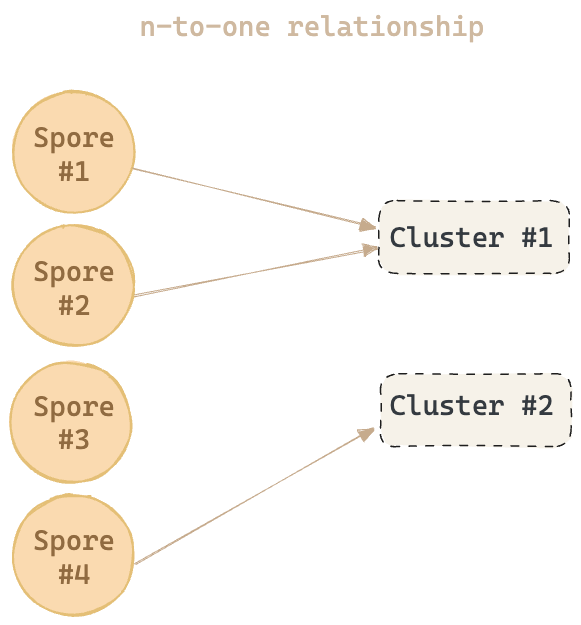

# Technical Design
> Spore protocol is engineered to embed value into on-chain contents and non-fungible tokens.

Spore is built on the [Cell model](https://docs.nervos.org/docs/basics/concepts/cell-model/), an extension of of Bitcoin UTXO, providing enhanced asset ownership and proof-based verification capabilities.

There are two defined cell types: `Spore Cell` and `Spore Cluster Cell`, of which Spore cell is the fundamental and the only necessary unit in the protocol. Other cell types are optional and may serve as extension cells, providing extra information to a Spore.



As illustrated above,

- Multiple Spores cells (Spore #1, #2) can be assigned to a Cluster (Cluster #1)
- A single Spore cell (Spore #4) can be assigned to a Cluster (Cluster #2)
- A standalone Spore cell can exist without being associated with any Cluster (Spore #3)
- A Spore cell cannot be assigned to multiple Clusters

Importantly, Cluster Cells don't *contain* Spore Cells.


Spore Protocol is anchored around the following key functionalities:

- Immutable digital asset issuance
- Permanent on-chain storage
- Minimized cell specification dedicated for content storage
- Built-in extensibility on the protocol level


## Data structure

Spore Protocol uses [Molecule](https://github.com/nervosnetwork/rfcs/blob/master/rfcs/0008-serialization/0008-serialization.md#molecule) as its serialization format standard. Basic types used in this standard are described as bellow:

```css
vector Bytes <byte>;
array Bool [byte; 1];
option BoolOpt (Bool);
option BytesOpt (Bytes);
```

### Spore Cell

Every Spore must follow this data structure:

```yaml
data:
    content-type: Bytes # String Bytes
    content: Bytes
    # OPTIONAL
    cluster_id: Bytes
type:
    hash_type: "data1"
    code_hash: SPORE_TYPE_DATA_HASH
    args: SPORE_ID
lock:
    <user_defined>
```

- `content-type` - Specifies the format of the `content` (like image/png) following [MIME standards](https://datatracker.ietf.org/doc/html/rfc2046). It can include parameters (e.g., `immortal=true` for indestructible NFTs). 
- `content` - Holds the main content of the NFT.
- `cluster_id` - An optional field for categorizing the NFT into a series or collection.
- `type` - Type script is set to `SPORE_TYPE_DATA_HASH`  with `SPORE_ID` as an argument that follows the rules of [Type ID script](/glossary/terms#type-id)
    - SPORE_ID = hash(this_transaction.inputs[0]) | Output_Index_Of_This_Cell

All the fields in a Spore Cell are immutable once created.

### Cluster Cell

Every Cluster must follow this data structure.

```css
data:
    name: Bytes # String Bytes
    description: Bytes # String Bytes
type:
    hash_type: "data1"
    code_hash: CLUSTER_TYPE_DATA_HASH
    args: CLUSTER_ID
lock:
    <user_defined>
```

- `name` - Represents the name of the Spore Cluster.
- `description` - Provides a textual description of the Cluster.
- `type` - Type script is set to `CLUSTER_TYPE_DATA_HASH`  with `CLUSTER_ID` as an argument that follows the rules of [Type ID script](/glossary/terms#type-id)
    - CLUSTER_ID = hash(this_transaction.inputs[0]) | Grouputput_index_of_this_cell

A Cluster Cell is indestructible and immutable once created.


:::info
The key words “MUST”, “MUST NOT”, “REQUIRED”, “SHALL”, “SHALL NOT”, “SHOULD”, “SHOULD NOT”, “RECOMMENDED”, “MAY”, and “OPTIONAL” in this document are to be interpreted as described in [RFC 2119](https://datatracker.ietf.org/doc/html/rfc2119).
:::
