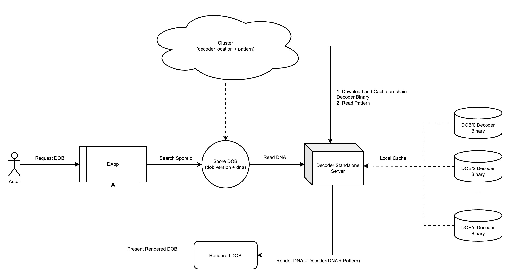
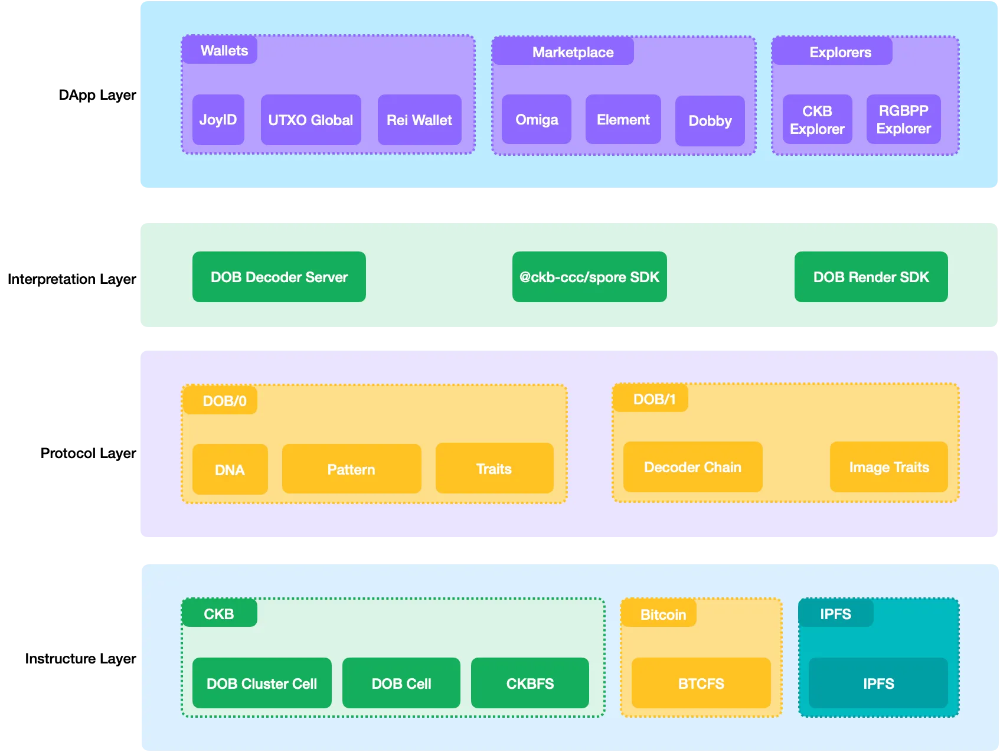
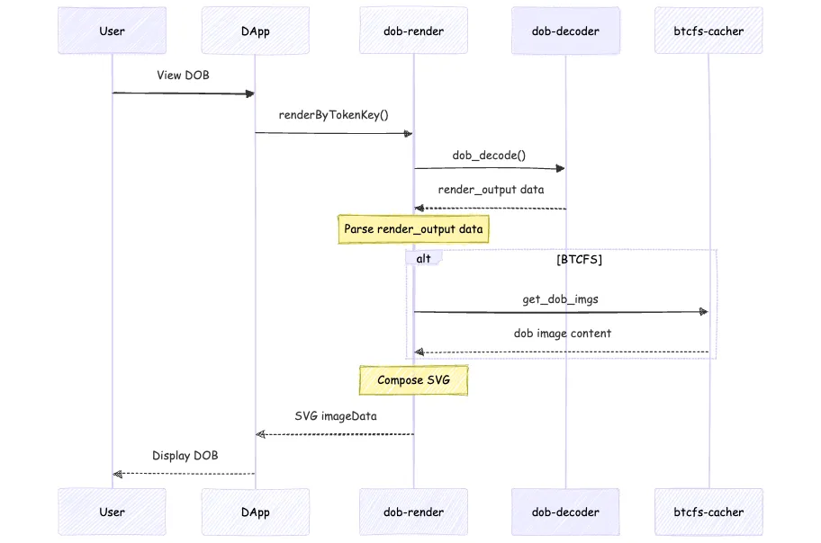

# DOB Protocol Family

## Introduction

The DOB (Digital Object) protocol family is built on top of the Spore protocol, providing standardized interpretation and composition capabilities for digital assets on CKB. While the Spore protocol stores value in Cells, the DOB protocol family establishes the foundation for how these Cells can be interpreted and combined.

The DOB protocol family contains multiple protocols, such as DOB/0, DOB/1 or DOB/2. They are all based on the abstract combination of `DNA + Pattern + Decoder`:

- `DNA`: Unique data owned by each DOB, specified when the DOB is minted.
- `Pattern` : Common data for a set of DOBs specified when creating the DOB Cluster.
- `Decoder` : Interpreter for `DNA` and `Pattern`, specified when DOB Cluster is released. Creators give simple bytes the ability to describe themselves through unrestricted decoders.

The figure below shows the relationship between DOB’s parties:



This design enables creators to give rich expressive capabilities to simple byte sequences through a flexible Decoder mechanism, completing the process of `DNA` → `Trait` → `Images` → `Render`.

## System Architecture
### DOB Ecosystem Architecture Diagram



The diagram above illustrates the DOB ecosystem architecture, which follows a layered structure from top to bottom:

- **DApp Layer**: Directly interacts with users, including wallets, marketplaces, explorers, and asset managers that display DOBs.
- **Interpretation Layer**: Responsible for encoding creator intentions into `DOB/0` and `DOB/1` data (via `@ckb-ccc/spore`), and decoding this data into images (via `DOB Decoder` and `DOB Render`). This layer serves as a bridge between the application and protocol layers.
- **Protocol Layer**: Defines the encoding and decoding specifications for `DOB/0`, `DOB/1`, etc., enabling proper processing by the interpretation layer.
- **Infrastructure Layer**: Stores data across various systems - `DOB Clusters` and `DOBs` are stored on the CKB chain, while `BTCFS` exists on Bitcoin.

The second and third layers belong to the DOB protocol family, following a modular design approach where each module serves a specific purpose. Let's examine how a `DOB` is loaded and rendered from a user's perspective.

### Interaction Sequence Diagram



The sequence diagram shows the following process:

- When a user views a `DOB` in the Dapp layer (browser, wallet, marketplace, etc.), the Dapp calls the `renderByTokenKey()` method of `dob-render` with the DOB's unique ID (`sporeId`) to render it.
- Within `dob-render`:
  - It calls the `dob_decode` method of `dob-decoder` with the DOB's unique ID to obtain the `render_output` data.
  - It parses the `render_output` top-down, separating Traits properties from Images used for rendering.
- For images:
  - `BTCFS`: Retrieves image content from `btcfs-cacher` using URIs in the format `btcfs://xxxxxxxi0`.
  - `IPFS`: Converts `ipfs://xxxxxxx` URIs to `https://ipfs.io/ipfs/xxxx` to request image content.
- Once all images are loaded, `dob-render` assembles them into a final SVG according to `render_output` specifications.
- The DApp receives the `SVG` from `dob-render`, converts it to base64 image data, and sets it as the src attribute of the DOB card's `` tag for display.

## Links

Common decoding server for DOB protocol family https://github.com/sporeprotocol/dob-decoder-standalone-server

## Protocols

### [DOB/0 Protocol](/dob/dob0-protocol)
The first step in the DOB protocol family. The DOB/0 protocol specifies the configuration method and interface format of the decoder on DOB and provides a universal decoder to reduce the development workload of most applications.

### [DOB/1 Protocol](/dob/dob1-protocol)
DOB1 protocol aims to assemble SVG images which uses the DOB0's output as its input parameters. Since SVG content is in format of XML-like, DOB1 protocol acts as an alternative version of DOB0 that only serves to generate SVG content string.


## Create DOB using DOB/0 protocol

Create a Cluster with DOB/0 protocol

```jsx
import { createCluster } from '@spore-sdk/api';
import { bytifyRawString } from '@spore-sdk/helpers/buffer';

const account = ...;
const dob_metadata = {
  description: 'this is the description for cluster',
  dob: {
    ver: 0,
    decoder: {
      type: 'code_hash',
      hash: '...',
    },
    pattern: [["Age", "number", 1, 1, "range", [0, 100]]],
  }
};

const { txSkeleton, outputIndex } = await createCluster({
  data: {
    name: 'My First DOB Cluster',
    description: bytifyRawString(JSON.strinify(dob_metadata)),
  },
  fromInfos: [account.address],
  toLock: account.lock
});

// sign for txSkeleton
```

Create a DOB with `content_type` as `dob/0`

```tsx
import { createSpore } from '@spore-sdk/api';
import { bytifyRawString } from '@spore-sdk/helpers/buffer';

const account = ...;
const dob_cluster_id = ...;
const dob_content = {
  dna: 'df4ffcb5e7a283ea7e6f09a504d0e256'
};

const { txSkeleton, outputIndex } = await createSpore({
  data: {
    contentType: 'dob/0',
    content: bytifyRawString(JSON.strinify(dob_content)),
    clusterId: dob_cluster_id
  },
  fromInfos: [account.address],
  toLock: account.lock
});

// sign for txSkeleton
```

## DOB decoding interface

After creating the Spore DOB, you can view its `spore_id` data and decode its DNA through the `spore_id` and the decoding server. Before that, you need to install the decoding server locally:

```bash
$ git clone https://github.com/sporeprotocol/dob-decoder-standalone-server
$ RUST_LOG=dob_decoder_server=debug cargo run
```

The decoding server runs on CKB Testnet by default. To run it on CKB Mainnet, exchange the `setting.mainnet.toml` configuration in the root directory with the `setting.toml` configuration.

After starting the server, decode a specified Spore DOB by the following request:

```bash
$ echo '{
  "id": 2,
  "jsonrpc": "2.0",
  "method": "dob_decode",
  "params": [
      "<spore_id in hex format without 0x prefix>"
  ]
}' \
| curl -H 'content-type: application/json' -d @- \
http://localhost:8090
```
