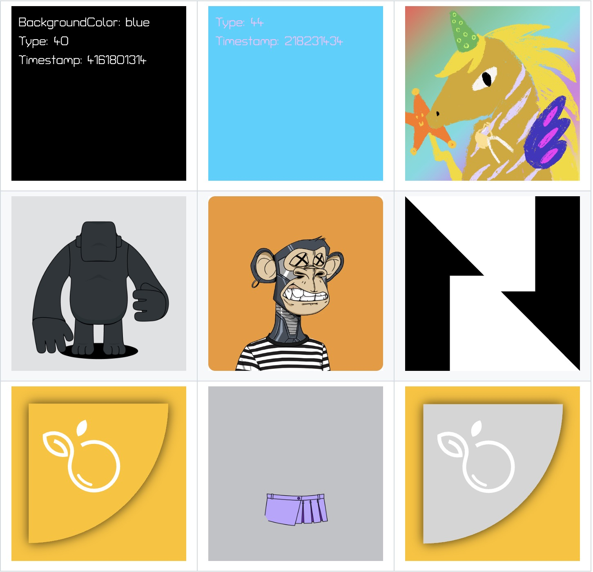
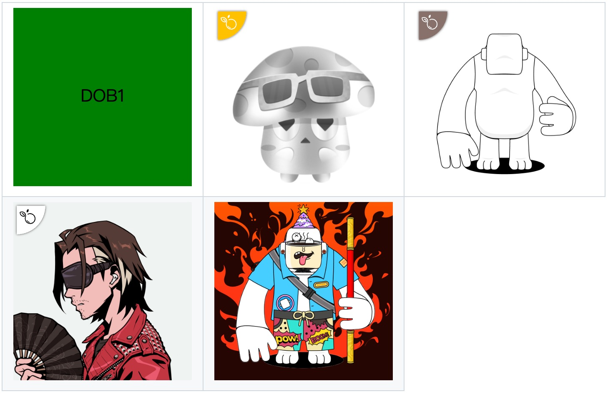

# DOB Cookbook 🔥

## Purpose and Scope
The [`dob-cookbook`](https://github.com/sporeprotocol/dob-cookbook) repository serves as a comprehensive implementation guide and example collection for Digital Objects (DOBs) on the Nervos CKB blockchain. This repository provides practical demonstrations of both DOB/0 and DOB/1 protocol implementations, showcasing various storage integration patterns, rendering techniques, and platform compatibility scenarios.

## Repository Architecture
The cookbook is organized around executable examples that demonstrate real-world DOB implementations across different storage systems and visual complexity levels.

Each example includes detailed implementation code, rendered visual effects, usage instructions, and specific considerations for that implementation pattern.

The repository is organized as follows:

- **examples/**: Root directory containing all example implementations
  - **assets/images/**: Contains image assets used in examples
  - **dob0/**: Examples implementing the DOB/0 protocol, containing:
    - Basic and colorful loot examples (`0.basic-loot.*`, `1.colorful-loot.*`)
    - Various storage integration patterns:
      - Regular link with PNG image (`2.regular-link-png.*`)
      - BTCFS i0 with PNG image (`3.btcfs-i0-png.*`)
      - IPFS with PNG image (`4.ipfs-png.*`)
      - Regular link with SVG image (`5.regular-link-svg.*`)
      - BTCFS i0 with SVG image (`6.btcfs-i0-svg.*`)
      - BTCFS i1 with PNG image (`7.btcfs-i1-png.*`)
      - BTCFS i1 with SVG image (`8.btcfs-i1-svg.*`)
  - **dob1/**: Examples implementing the DOB/1 protocol, containing:
    - Basic shape examples (`0.basic-shape.*`)
    - Various membership identifier implementations with different storage backends:
      - Spore membership with SVG background and BTCFS icon (`1.spore-genesis*`)
      - Nervape membership with BTCFS background and icon (`2.nervape-genesis*`)
      - Azuki membership with IPFS background and BTCFS icon (`3.azuki-genesis*`)
    - Composition examples (`4.nervape-compose*`)
  - Documentation files:
    - `BestPractices.md`: Best practices documentation in English
    - `BestPractices_ZH.md`: Best practices documentation in Chinese
    - `CONTRIBUTING.md`: Contribution guidelines

## Compatibility Status Overview
All DOB/0 examples demonstrate full compatibility across all tested platforms on both testnet and mainnet environments. DOB/1 examples show near-universal compatibility, with one known limitation in the Spore Genesis example on JoyID platform.

The cookbook includes detailed compatibility matrices that track rendering success across:

- [**JoyID**](https://app.joy.id/): Primary wallet with DOB support
- [**Omiga**](https://omiga.io/): Popular and widely-used DOB marketplace platform in the community
- [**CKB Explorer**](https://explorer.nervos.org/): CKB blockchain explorer
- [**Mobit**](https://mobit.app/): Comprehensive BTC and CKB Assets Management App
- [**Dobby**](https://app.dobby.market): Another DOB marketplace platform

## Resource Documentation
The cookbook includes comprehensive supporting documentation:

- **Best Practices**: Implementation guidelines available in both Chinese (BestPractices_ZH.md) and English (BestPractices.md)
- **FAQ**: Common questions and troubleshooting guidance (FAQ.md)
- **Contributing Guidelines**: Standards for submitting new examples (CONTRIBUTING.md)

## Explore Further

This documentation provides an overview of the DOB Cookbook repository. For a deeper understanding and to explore the actual code implementations, we encourage you to visit the [DOB Cookbook repository on GitHub](https://github.com/sporeprotocol/dob-cookbook). There you'll find all the example code, detailed explanations, and can even run the examples yourself to see how different DOB implementations work in practice. The repository is regularly updated with new examples and best practices as the DOB ecosystem evolves.