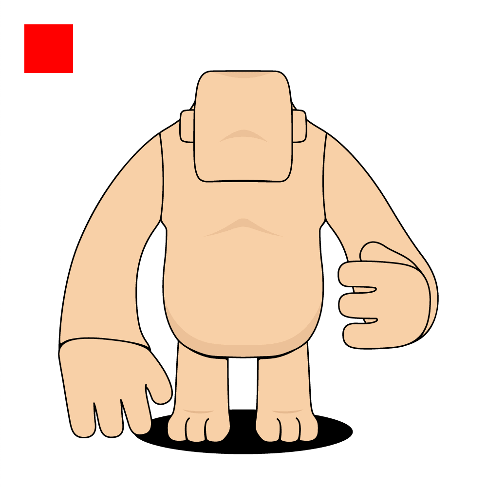

# DOB/1 Protocol

`DOB1` protocol aims to assemble `SVG` images which uses the DOB0's output as its input parameters. Since `SVG` content is in format of XML-like, `DOB1` protocol acts as an alternative version of `DOB0` that only serves to generate `SVG` content string.

## Introduction

`DOB1` protocol is dedicated for `IMAGE` generatation, specificly in type of `SVG`. It requires two decoders in pattern, the first is the original DOB0 protocol, taking responsibility to generate traits in `TEXT`, and the second is DOB1 protocol itself, processing previous decoder's output to generate SVG content.

`SVG` is only a description for arranging real images, in format of XML-like, so that users have to fill their persisted images' URI in `SVG` content fragments. `URI` can be in any functional type, for instance, image URL, base64 string of image content, or decentralized URI.

Talking on the decentralized persistence of real images, we always recommend two methods for now, they are respectively `btcfs://<tx-hash>i<image-list-index>` and `ipfs://<ipfs-token-id>`.

## How to use?
To use `DOB1` protocol in real world, we give below examples:

### Configure DOB pattern in DOB/1 Cluster

``` typescript
// Pattern instance in Cluster
{
  description: "Collection Description",
  dob: {
    ver: 1,
    decoders: [
      // DOB0 pattern
      {
        decoder: {
          type: "code_hash", // or "type_id" or "type_script"
          hash: "0x13cac78ad8482202f18f9df4ea707611c35f994375fa03ae79121312dda9925c", // exist when type is code_hash or type_id
          // script: ..., exist when type is type_script
        },
        pattern: [
          [
            "Face",
            "String",
            0,
            1,
            "options",
            ["Laugh", "Smile", "Sad", "Angry"]
          ],
          [
            "Age",
            "Number",
            1,
            1,
            "range",
            [0, 100]
          ],
          [
            "BirthMonth",
            "Number",
            2,
            1,
            "options",
            [1, 2, 3, 4, 5, 6, 7, 8, 9, 10, 11, 12]
          ],
          [
            "Score",
            "Number",
            3,
            1,
            "rawNumber"
          ]
        ]
      },
      // DOB1 pattern
      {
        decoder: {
          type: "type_script", // or "code_hash" or "type_id"
          script: {
            code_hash: "0x00000000000000000000000000000000000000000000000000545950455f4944",
            hash_type: "type",
            args: "0x784e32cef202b9d4759ea96e80d806f94051e8069fd34d761f452553700138d7"
          }
        },
        pattern: [
          [
            "IMAGE.0",
            "attributes",
            "",
            "raw",
            "xmlns='http://www.w3.org/2000/svg' viewBox='0 0 500 500'"
          ],
          [
            "IMAGE.0",
            "attributes",
            "Face",
            "options",
            [
              ["Laugh", "fill='#FFFF00'"],
              ["Smile", "fill='#FF00FF'"],
              ["Sad", "fill='#0000FF'"],
              ["Angry", "fill='#FF0000'"],
            ]
          ],
          [
            "IMAGE.0",
            "elements",
            "Age",
            "options",
            [
              [[0, 25], "<rect width='100' height='100' />"],
              [[50, 75], "<rect width='100' height='100' rx='15' />"],
              [["*"], "<rect x='25' y='25' width='50' height='50' />"],
            ]
          ],
          [
            "IMAGE.0",
            "elements",
            "BirthMonth",
            "options",
            [
              [[1, 5], "<image width='500' height='500' href='btcfs://b2f4560f17679d3e3fca66209ac425c660d28a252ef72444c3325c6eb0364393i0' />"],
              [[6, 9], "<image width='500' height='500' href='ipfs://QmeQ6TfqzsjJCMtYmpbyZeMxiSzQGc6Aqg6NyJTeLYrrJr' />"]
            ]
          ],
          [
            [
              10,
              12
            ],
            "<image width='500' height='500' href='btcfs://b2f4560f17679d3e3fca66209ac425c660d28a252ef72444c3325c6eb0364393i0' />"
          ]
        ]
      }
    ]
  }
}

```

You can also use the following configuration without comments, decoder's type is code_hash:
```typescript
{
  description: "Collection for docs.spore.pro",
  dob: {
    ver: 1,
    decoders: [
      {
        decoder: {
          type: "code_hash",
          hash: "0x13cac78ad8482202f18f9df4ea707611c35f994375fa03ae79121312dda9925c"
        },
        pattern: [
          [
            "Face",
            "String",
            0,
            1,
            "options",
            [
              "Laugh",
              "Smile",
              "Sad",
              "Angry"
            ]
          ],
          [
            "Age",
            "Number",
            1,
            1,
            "range",
            [
              0,
              100
            ]
          ],
          [
            "BirthMonth",
            "Number",
            2,
            1,
            "options",
            [
              1,
              2,
              3,
              4,
              5,
              6,
              7,
              8,
              9,
              10,
              11,
              12
            ]
          ],
          [
            "Score",
            "Number",
            3,
            1,
            "rawNumber"
          ]
        ]
      },
      {
        decoder: {
          type: "code_hash",
          hash: "0xda3525549b72970b4c95f5b5749357f20d1293d335710b674f09c32f7d54b6dc"
        },
        pattern: [
          [
            "IMAGE.0",
            "attributes",
            "",
            "raw",
            "xmlns='http://www.w3.org/2000/svg' viewBox='0 0 500 500'"
          ],
          [
            "IMAGE.0",
            "attributes",
            "Face",
            "options",
            [
              [
                "Laugh",
                "fill='#FFFF00'"
              ],
              [
                "Smile",
                "fill='#FF00FF'"
              ],
              [
                "Sad",
                "fill='#0000FF'"
              ],
              [
                "Angry",
                "fill='#FF0000'"
              ]
            ]
          ],
          [
            "IMAGE.0",
            "elements",
            "Age",
            "options",
            [
              [
                [
                  0,
                  25
                ],
                "<rect width='100' height='100' />"
              ],
              [
                [
                  50,
                  75
                ],
                "<rect width='100' height='100' rx='15' />"
              ],
              [
                [
                  "*"
                ],
                "<rect x='25' y='25' width='50' height='50' />"
              ]
            ]
          ],
          [
            "IMAGE.0",
            "elements",
            "BirthMonth",
            "options",
            [
              [
                [
                  1,
                  5
                ],
                "<image width='500' height='500' href='btcfs://b2f4560f17679d3e3fca66209ac425c660d28a252ef72444c3325c6eb0364393i0' />"
              ],
              [
                [
                  6,
                  9
                ],
                "<image width='500' height='500' href='ipfs://QmeQ6TfqzsjJCMtYmpbyZeMxiSzQGc6Aqg6NyJTeLYrrJr' />"
              ],
              [
                [
                  10,
                  12
                ],
                "<image width='500' height='500' href='btcfs://b2f4560f17679d3e3fca66209ac425c660d28a252ef72444c3325c6eb0364393i0' />"
              ]
            ]
          ]
        ]
      }
    ]
  }
}
```

You can also copy the following JSON configuration to [CCC CreateSporeCluster Demo](https://app.ckbccc.com/connected/CreateSporeCluster):
```json
{
    "description": "Collection for docs.spore.pro",
    "dob": {
        "ver": 1,
        "decoders": [
            {
                "decoder": {
                    "type": "code_hash",
                    "hash": "0x13cac78ad8482202f18f9df4ea707611c35f994375fa03ae79121312dda9925c"
                },
                "pattern": [
                    [
                        "Face",
                        "String",
                        0,
                        1,
                        "options",
                        [
                            "Laugh",
                            "Smile",
                            "Sad",
                            "Angry"
                        ]
                    ],
                    [
                        "Age",
                        "Number",
                        1,
                        1,
                        "range",
                        [
                            0,
                            100
                        ]
                    ],
                    [
                        "BirthMonth",
                        "Number",
                        2,
                        1,
                        "options",
                        [
                            1,
                            2,
                            3,
                            4,
                            5,
                            6,
                            7,
                            8,
                            9,
                            10,
                            11,
                            12
                        ]
                    ],
                    [
                        "Score",
                        "Number",
                        3,
                        1,
                        "rawNumber"
                    ]
                ]
            },
            {
                "decoder": {
                    "type": "code_hash",
                    "hash": "0xda3525549b72970b4c95f5b5749357f20d1293d335710b674f09c32f7d54b6dc"
                },
                "pattern": [
                    [
                        "IMAGE.0",
                        "attributes",
                        "",
                        "raw",
                        "xmlns='http://www.w3.org/2000/svg' viewBox='0 0 500 500'"
                    ],
                    [
                        "IMAGE.0",
                        "attributes",
                        "Face",
                        "options",
                        [
                            [
                                "Laugh",
                                "fill='#FFFF00'"
                            ],
                            [
                                "Smile",
                                "fill='#FF00FF'"
                            ],
                            [
                                "Sad",
                                "fill='#0000FF'"
                            ],
                            [
                                "Angry",
                                "fill='#FF0000'"
                            ]
                        ]
                    ],
                    [
                        "IMAGE.0",
                        "elements",
                        "Age",
                        "options",
                        [
                            [
                                [
                                    0,
                                    25
                                ],
                                "<rect width='100' height='100' />"
                            ],
                            [
                                [
                                    50,
                                    75
                                ],
                                "<rect width='100' height='100' rx='15' />"
                            ],
                            [
                                [
                                    "*"
                                ],
                                "<rect x='25' y='25' width='50' height='50' />"
                            ]
                        ]
                    ],
                    [
                        "IMAGE.0",
                        "elements",
                        "BirthMonth",
                        "options",
                        [
                            [
                                [
                                    1,
                                    5
                                ],
                                "<image width='500' height='500' href='btcfs://b2f4560f17679d3e3fca66209ac425c660d28a252ef72444c3325c6eb0364393i0' />"
                            ],
                            [
                                [
                                    6,
                                    9
                                ],
                                "<image width='500' height='500' href='ipfs://QmeQ6TfqzsjJCMtYmpbyZeMxiSzQGc6Aqg6NyJTeLYrrJr' />"
                            ],
                            [
                                [
                                    10,
                                    12
                                ],
                                "<image width='500' height='500' href='btcfs://b2f4560f17679d3e3fca66209ac425c660d28a252ef72444c3325c6eb0364393i0' />"
                            ]
                        ]
                    ]
                ]
            }
        ]
    }
}
```

### createSpore
```typescript
// DNA bytes in Spore 
{
    contentType: "dob/1",
    content: {
        dna: "efc2866a311da5b6dfcdfc4e3c22d00d024a53217ebc33855eeab1068990ed9d"
        // ..., other fields are optional
    },
    // or content: "0xefc2866a311da5b6dfcdfc4e3c22d00d024a53217ebc33855eeab1068990ed9d",
    // or content: ["0xefc2866a311da5b6dfcdfc4e3c22d00d024a53217ebc33855eeab1068990ed9d", ...(optional)]
    clusterId: "0x1678adfee30685347e7d902179a4d6bb5f9fc06d4d130dc1ea5ccd6668d7dbc8"
}
```

After decoding by dob-decoder, the possible result might be as below 

```xml
<svg xmlns='http://www.w3.org/2000/svg' viewBox='0 0 500 500' fill='#FF0000'>
    <rect x='25' y='25' width='50' height='50' />
    <image width='500' height='500' href='btcfs://b2f4560f17679d3e3fca66209ac425c660d28a252ef72444c3325c6eb0364393i0' />
</svg>
```

### render result
The result of rendering the DOB is shown below:



`btcfs://...` in image's href cannot be recongnized as an image in direct, so the [dob-render-sdk](https://github.com/nervina-labs/dob-render-sdk) that provided by JoyID team can turn it into a base64 string of the raw image content from BTC network, and so does the samilar for `ipfs://...`.

## Related Repo
1. dob-standalone-decoder-server: https://github.com/sporeprotocol/dob-decoder-standalone-server
2. spore-dob-0: https://github.com/sporeprotocol/spore-dob-0
3. spore-dob-1: https://github.com/sporeprotocol/spore-dob-1

## Latest DOB/1 Decoder On-chain Information

`code_hash`: 0xda3525549b72970b4c95f5b5749357f20d1293d335710b674f09c32f7d54b6dc

`tx_hash`:
* testnet: 0x18c8f1d55906cf9932c5a72ae4dc039e51e41089db6829edb3f92078c6520bc8
* mainnet: 0x99cc81b5e4c311519173f3f6f771dff64a2f64c97f5f724877c4352cd1b3b32c

`type_id`:
* testnet: 0x784e32cef202b9d4759ea96e80d806f94051e8069fd34d761f452553700138d7
* mainnet: 0x8892bea4405a1f077921799bc0f4516e0ebaef7aea0dfc6614a8898fb47d5372

`type_script`:
* testnet:
```javascript
{
    "code_hash": "0x00000000000000000000000000000000000000000000000000545950455f4944",
    "hash_type": "type",
    "args": "0x784e32cef202b9d4759ea96e80d806f94051e8069fd34d761f452553700138d7"
}
```
* mainnet:
```javascript
{
    "code_hash": "0x00000000000000000000000000000000000000000000000000545950455f4944",
    "hash_type": "type",
    "args": "0x8892bea4405a1f077921799bc0f4516e0ebaef7aea0dfc6614a8898fb47d5372"
}
```

You can also check the latest on-chain information in these files as below:
* testnet: https://github.com/sporeprotocol/dob-decoder-standalone-server/blob/master/settings.toml#L71
* mainnet: https://github.com/sporeprotocol/dob-decoder-standalone-server/blob/master/settings.mainnet.toml#L58