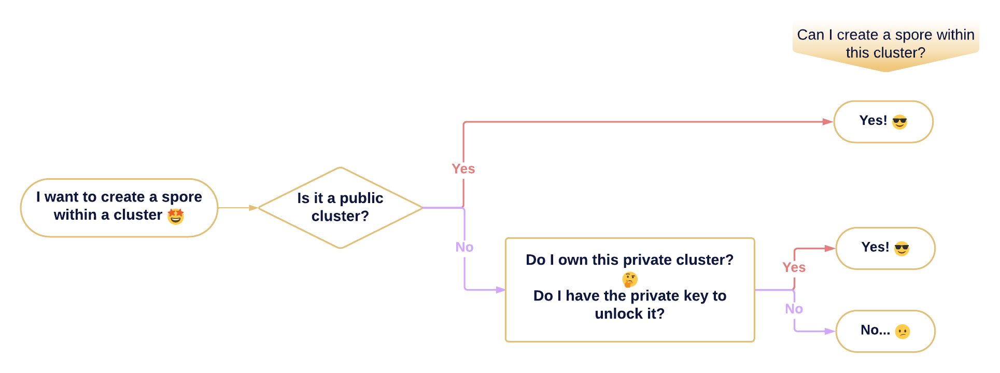

# Tag Spore With Cluster

:::info Background knowledge

- [What is a Spore? - Spore Protocol 101](/basics/spore-101#what-is-a-spore)
- [What is a Cluster? - Spore Protocol 101](/basics/spore-101#what-is-a-cluster)
- [Create a Spore - How-to Recipes](/recipes/create-spore)
- [Create a Private Cluster - How-to Recipes](/recipes/create-private-cluster)

:::

Clusters serve as on-chain tagging tools that group Spores together. In this recipe, you’ll learn how to use a Cluster as a tag when creating a Spore. 

:::caution

- You can only utilize a Cluster as a tag if it can be unlocked by you to use. 
- You cannot tag a Spore after its creation; you'll need to destroy and then tag it during the creation process.
- Each Spore can be associated with only one Cluster.

:::

Your target cluster can be either a public cluster or a private cluster, depending on the its lock script.

- `Private Cluster` - In the case of a private cluster,  it can be unlocked using your signature, if you possess the private key paired with that cluster's lock script.
- `Public Cluster` - In contrast, a public cluster doesn't require a signature to unlock. In this case, anyone can unlock it, including you.



## Tag a Spore With a Cluster

You can tag a spore with a cluster by specifying the `data.clusterId` when calling the `createSpore` API from spore-sdk:

```tsx
import { createSpore } from '@spore-sdk/core';

let { txSkeleton } = await createSpore({
  data: {
    contentType: CONTENT_MIME_TYPE,
    content: CONTENT_AS_BYTES,
    // highlight-next-line
    clusterId: CLUSTER_ID,
  },
  toLock: OWNER_LOCK,
  fromInfos: [OWNER_ADDRESS],
});
```

- `data.clusterId` - The ID of the cluster to be assigned to the spore. The cluster's ID is equivalent to the type script args of the cluster.

