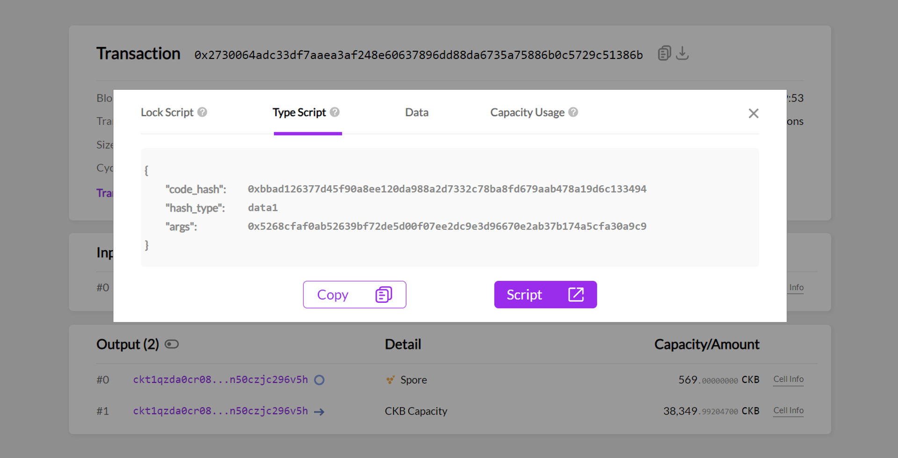
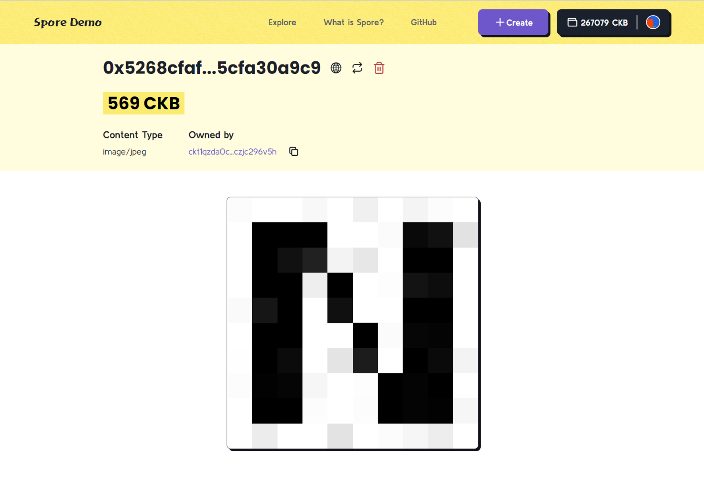

# Create Spore

In this section, we'll create an on-chain spore with an image file as its content, using the private key you generated in the [previous section](./setup-account). Then, we'll learn about how to view your newly created spore.

## Create a spore on-chain

We prepared a ready-to-run project [`spore-first-example`](https://github.com/sporeprotocol/spore-first-example) with all the necessary code to create a spore on-chain in seconds. Run the example on StackBlitz by following these steps:

1. Paste your private key to replace the default one at line 5
2. Type and run the command in the terminal: `npm run example`
3. Ta-da! Your new spore is created on-chain with `./image.jpg` as its content

<iframe
  width="100%"
  height="600px"
  frameborder="0"
  src="https://stackblitz.com/github/sporeprotocol/spore-first-example?ctl=1&embed=1&file=src/index.ts&view=editor"
  sandbox="allow-scripts allow-popups allow-top-navigation-by-user-activation allow-forms allow-same-origin allow-storage-access-by-user-activation"
/>

:::caution

Remember: NEVER share your private key publicly for production.

:::

## View your new spore

Once you've executed the `npm run example` command, a fresh spore is created on-chain, carrying the example image as its content. You'll see a message like this in the terminal:

```yaml
Spore created at: https://pudge.explorer.nervos.org/transaction/0x2730064adc33df7aaea3af248e60637896dd88da6735a75886b0c5729c51386b
Spore ID: 0x5268cfaf0ab52639bf72de5d00f07ee2dc9e3d96670e2ab37b174a5cfa30a9c9
```

There are two ways to view your spore:

### Method 1: Via CKB Explorer

To view on CKB Explorer, open the URL printed in the terminal:

```yaml
Spore created at: https://pudge.explorer.nervos.org/transaction/0x2730064adc33df7aaea3af248e60637896dd88da6735a75886b0c5729c51386b
```

On the explorer page, the `Outputs#0` represents the new spore.


Click the `Cell Info` button at the end of the line for more details.



You can check your spore's ID through `Type Script` → `args`. A Spore ID is a 32-byte hash ensuring that each spore has its unique ID.

** For more information, see:*

- [Introduction to CKB Script Programming 6: Type ID](https://xuejie.space/2020_02_03_introduction_to_ckb_script_programming_type_id/)
- [CKB RFC 0022: Transaction Structure](https://github.com/nervosnetwork/rfcs/blob/master/rfcs/0022-transaction-structure/0022-transaction-structure.md#type-id)

### Method 2: Via Spore Demo

You can view your spore on [Spore Demo](https://a-simple-demo.spore.pro), a web application we made for visualizing image spores. Your spore is accessible via its URL:

```yaml
https://a-simple-demo.spore.pro/spore/{spore_id}
```

For example, the spore featured in Method 1 can be accessed [here](https://a-simple-demo.spore.pro/spore/0x5268cfaf0ab52639bf72de5d00f07ee2dc9e3d96670e2ab37b174a5cfa30a9c9)



## Check point

Congratulations on successfully creating your first Spore on-chain, featuring the dazzling Nervos CKB logo as its image content. You can now view it through both CKB Explorer and Spore Demo.

In this tutorial, you learned how to:

1. Create a CKB address and obtain CKBytes tokens
2. Set up your project with Spore SDK
3. Mint your spore on-chain and verify the transaction

## Next

In the upcoming section, we'll delve deeper into the mechanics behind these examples, let's explore the code!
