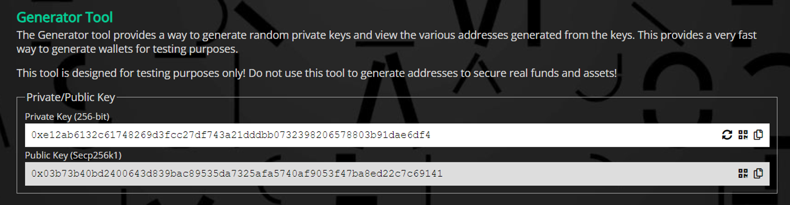
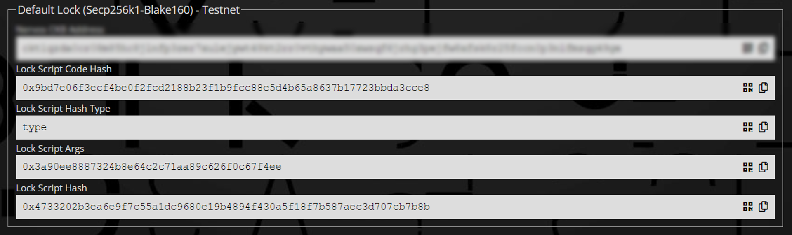
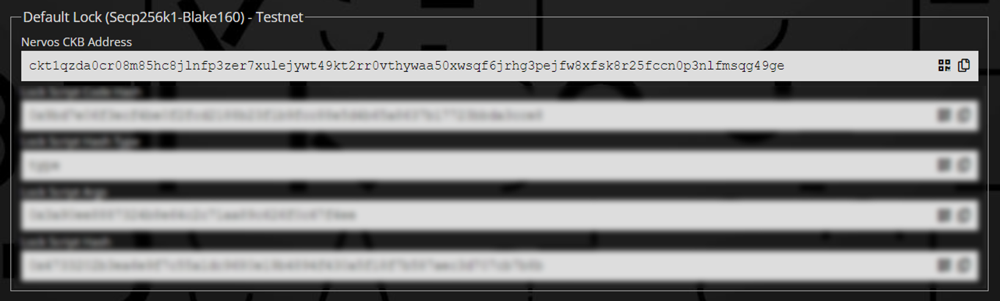
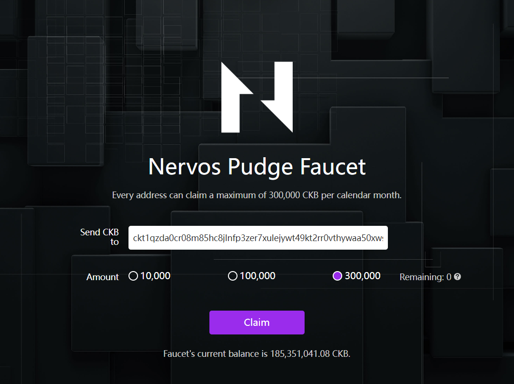
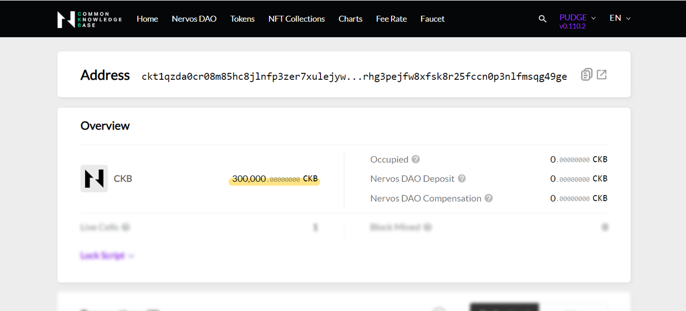

# Set Up Account

In this section, we'll guide you through the process of creating a Nervos CKB "account" and acquiring testnet CKBytes, so you have enough capital to create your fully on-chain asset.

## Create an "account"

To begin, you'll need to generate a private key. This private key acts as your Nervos CKB "account" - a randomly generated number that grants you full control over your funds associated with a specific lock script.

### Step 1: Generate a private key

1. Go to [Generator - CKB Tools](https://ckb.tools/generator)
2. Click the 🔄 refresh button
3. You'll now have a 32-byte private key generated under "Private Key (256-bit)"

### Step 2: Locate the Lock Script

Lock Script is used to represent ownership in Nervos CKB. You can create various Lock Scripts, each serving a unique on-chain purpose, with your newly generated private key (your Nervos CKB "account"). In this tutorial, we'll use the most commonly used lock script, the [`CKB default lock`](https://github.com/nervosnetwork/ckb-system-scripts/blob/master/c/secp256k1_blake160_sighash_all.c).

On the CKB Tools page, you'll find the "Default Lock (Secp256k1-Blake160) - Testnet" section, showing the details of the `CKB default lock` generated from your private key.

### Step 3: Locate the CKB address

A CKB address is a hexadecimal string that represents a lock script. It's used for sending and receiving crypto assets. Each address corresponds to a specific lock script. Find your "Nervos CKB Address" inside the "Default Lock (Secp256k1-Blake160) - Testnet" section, and be sure to note it down for future interactions.

## Claim CKBytes from faucet

Now that you have your CKB Address (Nervos CKB "account"), it's time to claim some free testnet CKBytes from the faucet so you have enough capital for on-chain transactions.

### Step 1: Claim CKBytes from faucet

1. Go to [Nervos Faucet](https://faucet.nervos.org/)
2. Paste your **CKB address** (starting with ckt….) into the input field.
3. Click the "Claim" button and wait for the process to complete

### Step 2: Check your balance

1. Go to [CKB Explorer (Testnet)](https://pudge.explorer.nervos.org/)
2. Paste your CKB address into the search input field
3. Press enter to search for the address, and your balance will be displayed in the "Overview" section

## Next

With your "account" set up and loaded, let's proceed to create your first spore on Nervos CKB Testnet: [Create your first spore on-chain](./create-spore).
